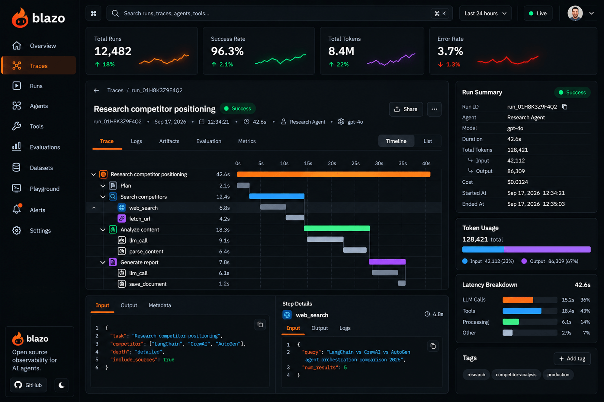
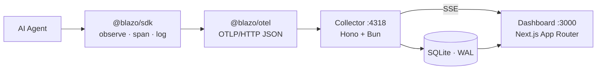

<div align="center">

# Blazo

**Open-source observability for AI agents.**

Install it, run an agent, and immediately watch its execution live — locally, in real time, no account.

[](https://github.com/agentblazo/blazo/releases)
[](#license)
[](https://github.com/agentblazo/blazo/stargazers)
[](https://github.com/agentblazo/blazo/issues)
[](https://github.com/agentblazo/blazo/pulls)

[](https://bun.sh)
[](https://www.typescriptlang.org)
[](https://nextjs.org)
[](https://opentelemetry.io)
[](https://sqlite.org)

<a href="assets/dashboard-mockup.png">
  
</a>

**Target design** — this is the direction Blazo is building toward, not the current UI.

</div>

---

## Why Blazo

Blazo observes AI agents end-to-end and helps a developer understand what actually happened. It answers "why is my agent slow, stuck, or failing?" from real telemetry — not from a prompt playgro[...]

It is an **observability product** — deliberately **not** an agent builder, playground, or evaluation platform.

> **The promise:** install Blazo, run an agent, and immediately see its execution live.

---

## Architecture



The root span from `observe(name, fn)` becomes a **Run**; child spans become timeline events. The collector normalizes telemetry on ingest, runs deterministic detection rules, and pushes updates o[...]

---

## Features

- **Automatic instrumentation** — `observe()`, `span()` and `log()` on top of OpenTelemetry (OTLP/HTTP, JSON).
- **Live dashboard** — run list, run detail with a hand-built timeline + step inspector, logs, errors and findings, updating in real time over SSE.
- **Deterministic detection** (no ML) — `long_running`, `repeated_tool`, `repeated_error`, `no_activity`, `possible_loop`.
- **CLI** — `init`, `watch` (live TUI), `runs`, `inspect`.
- **Local-first** — SQLite (WAL mode), no account, no cloud.

---

## Quick start

### Requirements

| Requirement | Version | Notes |
| ----------- | ------- | ----- |
| [Bun](https://bun.sh) | latest | Managed via [mise](https://mise.jdx.dev) (`.mise.toml` pins `bun = "latest"`) |
| [Node.js](https://nodejs.org) | 20+ | Only needed to run the dashboard / SDK outside Bun |
| Git | any | To clone the repository |

### 1. Install

```bash
git clone https://github.com/agentblazo/blazo.git
cd blazo

mise install            # or: brew install bun / curl -fsSL https://bun.sh/install | bash
bun install
```

### 2. Start Blazo

```bash
bun apps/cli/src/index.ts watch
```

`watch` starts the collector (port **4318**) and the dashboard (port **3000**) and shows a live TUI of runs and events. Open **http://localhost:3000**. Press `Ctrl+C` to stop everything.

Prefer to run each service on its own?

```bash
bun apps/collector/src/index.ts        # collector on :4318
bun run dev --cwd apps/dashboard       # dashboard on :3000
```

### 3. Run an agent

```bash
bun run --cwd examples/basic-agent start
```

The run appears in the dashboard within ~2s — live, no reload.

---

## SDK — `@blazo/sdk`

```ts
import { observe, span, log } from "@blazo/sdk";

await observe("research-agent", async () => {
  log("info", "agent started", { version: "0.1.0" });

  await span("llm.chat", () => callModel(prompt), { type: "llm" });
  await span("tool.search", () => search(query), { type: "tool" });
});
```

| API | Description |
| --- | ----------- |
| `observe(name, fn, options?)` | Wraps an agent entry point; returns `fn`'s result; marks the run `success`/`error` and records exceptions. |
| `span(name, fn, options?)` | A unit of work within the run. `options.type` (`llm \| tool \| agent \| error \| session`) drives dashboard styling. |
| `log(level, message, metadata?)` | A structured log line attached to the active run. |
| `configure()` / `shutdown()` | Set up and flush the OpenTelemetry providers. Call `shutdown()` before exit so buffered telemetry is exported. |

The endpoint is resolved from `BLAZO_ENDPOINT`, then `OTEL_EXPORTER_OTLP_ENDPOINT`, defaulting to `http://127.0.0.1:4318`.

---

## CLI — `blazo`

```bash
blazo init                  # write a default blazo.config.json
blazo watch                 # start collector + dashboard, live TUI
blazo runs [--limit N]      # list recent runs
blazo inspect <run-id>      # full report: timeline, logs, errors, findings
```

During development, run through the source entry point:

```bash
bun apps/cli/src/index.ts <command>
```

| Global option | Description |
| ------------- | ----------- |
| `--collector <url>` | Attach to a specific collector |
| `--json` | Machine-readable output (`runs`, `inspect`) |
| `--no-spawn-collector` | Attach to an existing collector instead of starting one (`watch`) |
| `--no-dashboard` | Do not start the dashboard (`watch`) |

---

## Dashboard

Six screens, all live-updating over SSE:

| Screen | Route | Contents |
| ------ | ----- | -------- |
| Overview | `/` | Metric cards, active/slow/recent runs, findings, top errors |
| Runs | `/runs` | id, agent, status, duration, tokens, cost, started |
| Run Detail | `/runs/[id]` | Summary, timeline, step inspection, logs, errors, findings |
| Errors | `/errors` | Errors grouped by signature, click-through to affected runs |
| Logs | `/logs` | Recent logs with a level filter |
| Settings | `/settings` | Effective local config |

---

## Detection

Deterministic rules turn run data into **findings**, evaluated on ingest and on a periodic sweep (default every 5s):

| Rule | Trigger | Severity |
| ---- | ------- | -------- |
| `long_running` | duration > threshold | warning / critical |
| `repeated_tool` | same tool called N times | warning / critical |
| `repeated_error` | same error raised N times | critical |
| `no_activity` | no event for N seconds | warning |
| `possible_loop` | loop detection | critical |

Thresholds live in `blazo.config.json` (see below).

---

## Configuration

`blazo init` writes a `blazo.config.json` with defaults:

```json
{
  "endpoint": "http://127.0.0.1:4318",
  "collector": { "host": "127.0.0.1", "port": 4318 },
  "dashboard": { "host": "127.0.0.1", "port": 3000 },
  "database": { "path": ".blazo/blazo.db" },
  "detection": {
    "longRunningMs": 30000,
    "repeatedToolCount": 3,
    "repeatedErrorCount": 3,
    "noActivityMs": 30000,
    "loopRepeatCount": 4
  }
}
```

---

## Collector API

| Method | Endpoint | Description |
| ------ | -------- | ----------- |
| `POST` | `/v1/traces` | OTLP/HTTP trace ingest |
| `POST` | `/v1/logs` | OTLP/HTTP log ingest |
| `GET` | `/health` | Liveness |
| `GET` | `/api/runs` | Recent runs |
| `GET` | `/api/runs/:id` | Run + spans + logs + errors + findings |
| `GET` | `/api/runs/:id/events` | Spans only |
| `GET` | `/api/errors` | Errors grouped by signature |
| `GET` | `/api/logs?level=` | Recent logs, optional level filter |
| `GET` | `/api/findings` | Recent findings |
| `GET` | `/api/overview` | Metrics + lists for the overview page |
| `GET` | `/api/config` | Effective config |
| `GET` | `/api/stream` | SSE stream |

SSE events: `run.started`, `span.completed`, `log.created`, `error.created`, `finding.created`, `run.completed`.

---

## Tech stack

| Layer | Technology |
| ----- | ---------- |
| Monorepo | Turborepo |
| Package manager / runtime | Bun |
| Language | TypeScript |
| SDK | TypeScript + OpenTelemetry |
| Telemetry | OpenTelemetry / OTLP over HTTP |
| Collector | Hono + Bun |
| API validation | Zod |
| Database | SQLite (WAL mode) |
| ORM | Drizzle |
| Dashboard | Next.js (App Router) + Tailwind |
| Realtime | SSE (no Redis) |
| CLI | Bun + cac |
| Testing | Bun Test + Playwright |
| Lint / format | Biome |

---

## Repository layout

```
blazo/
├── apps/
│   ├── dashboard/     # Next.js (App Router) + Tailwind
│   ├── collector/     # Hono + Bun (OTLP/HTTP ingest, normalize, detect, SSE)
│   ├── cli/           # Bun + cac (init / watch / runs / inspect)
│   └── e2e/           # Playwright end-to-end tests
├── packages/
│   ├── sdk/           # @blazo/sdk   (observe / span / log)
│   ├── otel/          # @blazo/otel  (tracer/logger providers, OTLP/HTTP exporters)
│   ├── database/      # Drizzle + bun:sqlite (schema, migrations, WAL)
│   ├── detection/     # deterministic rules -> Findings
│   ├── types/         # shared domain contracts
│   ├── config/        # blazo config load/write + Zod validation
│   └── ui/            # product-specific primitives
├── examples/basic-agent/
├── docker/docker-compose.yml
├── assets/            # README images
├── turbo.json
├── package.json
└── biome.json
```

---

## Development

```bash
bun install          # install dependencies
bun run typecheck    # typecheck all packages
bun run lint         # Biome check
bun run lint:fix     # Biome check + autofix
bun run test         # Bun tests (sdk, detection, collector, database)
bun run test:e2e     # Playwright end-to-end
bun run build        # build (dashboard)
bun run db:generate  # generate Drizzle migrations
bun run db:migrate   # apply migrations
```

### End-to-end tests

The Playwright suite (`apps/e2e`) starts the collector and dashboard automatically and drives the full flow: instrument → run → run appears live → timeline → error/finding detected.

It uses an existing Chrome/Chromium binary (agent-browser's Chrome for Testing by default). To point it elsewhere:

```bash
PLAYWRIGHT_CHROME_PATH=/path/to/chrome bun run test:e2e
```

On Linux, if Chrome needs system libraries (e.g. `libnss3`), export `LD_LIBRARY_PATH` to the directory containing them before running the tests.

---

## Data model

- **Run** — `id, agent, status, started_at, ended_at, duration, tokens, cost`
- **Span** — normalized from OTLP spans: `run_id, parent_id, type, name, status, started_at, ended_at, duration, metadata`
- **Log** — `run_id, span_id, timestamp, level, message, metadata`
- **Error** — `run_id, span_id, type, message, stack, agent, timestamp`
- **Finding** — `run_id, type, severity, message, created_at`

The schema lives in `packages/database` with Drizzle migrations.

---

## Design decisions

- **OTLP/HTTP (port 4318), not gRPC** — JSON payloads parsed by the collector.
- **Bun-native everywhere except the SDK** — the SDK stays Node + Bun compatible.
- **No chart library** — the timeline is hand-built for full control of Blazo's identity.
- **No Redis** — SSE for realtime.
- **Detection is deterministic only** — no ML/AI.

### Out of scope (by design)

No evaluations, playground, prompt management, datasets, or agent marketplace. No SaaS (billing, orgs, RBAC, SSO), no cloud, no AI/ML analysis. One integration only: the TypeScript SDK.

---

## Contributing

Contributions are welcome. Open an [issue](https://github.com/agentblazo/blazo/issues) to discuss a change, then send a pull request. Before opening a PR, run:

```bash
bun run lint && bun run typecheck && bun run test
```

---

## License

This project is licensed under the [MIT License](LICENSE).

Copyright (c) 2026 agentblazo

Permission is hereby granted, free of charge, to any person obtaining a copy
of this software and associated documentation files (the "Software"), to deal
in the Software without restriction, including without limitation the rights
to use, copy, modify, merge, publish, distribute, sublicense, and/or sell
copies of the Software, and to permit persons to whom the Software is
furnished to do so, subject to the following conditions:

The above copyright notice and this permission notice shall be included in all
copies or substantial portions of the Software.

THE SOFTWARE IS PROVIDED "AS IS", WITHOUT WARRANTY OF ANY KIND, EXPRESS OR
IMPLIED, INCLUDING BUT NOT LIMITED TO THE WARRANTIES OF MERCHANTABILITY,
FITNESS FOR A PARTICULAR PURPOSE AND NONINFRINGEMENT. IN NO EVENT SHALL THE
AUTHORS OR COPYRIGHT HOLDERS BE LIABLE FOR ANY CLAIM, DAMAGES OR OTHER
LIABILITY, WHETHER IN AN ACTION OF CONTRACT, TORT OR OTHERWISE, ARISING FROM,
OUT OF OR IN CONNECTION WITH THE SOFTWARE OR THE USE OR OTHER DEALINGS IN THE
SOFTWARE.

<div align="center">
<sub>Blazo · Product: <b>AgentBlazo</b> · <a href="https://github.com/agentblazo/blazo">github.com/agentblazo/blazo</a></sub>
</div>
